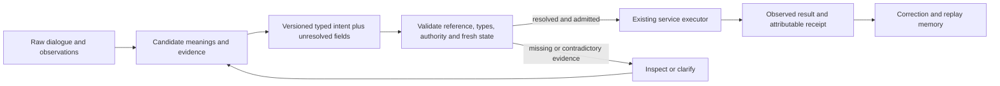

# PanSigna after v0.3: semantic continuity across changing agents

2026-09-10. Assistant-authored synthesis and proposed experiments, informed by
two independent agent reviews and the completed local v0.3 results. This extends
Ryan Smith's conception; it does not retroactively attribute these proposals to
his original notes. It is neither a ratified ontology nor a deployed Qthonic service.

## Astra's assessment

The largest opportunity I see is a public interface through which different
models can preserve, contest and repair the consequences of their understanding.
Stable notion identities, explicit aliases and a calculus could give that interface
durable structure. Useful communication need not require identical private latent
representations, or every internal distinction to correspond to a human word.

The blind spot in our current experimental framing is the jump from an addressable
concept to an addressable implementation of that concept. An ID provides a name.
An ordinary language model still learns its own computation. A public semantic
contract can be valuable before that computation becomes fully interpretable.

The distinction between definitions and meanings remains central. Public definitions
can state types, assumptions, consequences and executable rules; learned meanings
can retain contextual associations and unresolved distinctions. Their interface
needs many-to-many, revisable mappings. A consortium can maintain definitions,
compatibility tests and migrations while recording legitimate disagreement.

## What an agent needs beyond a dictionary

**Unfinished understanding.** Unknown, ambiguous, conflicting and deliberately
underspecified are different states. They call for different actions. Replacing
them with one synset or confidence number can erase the very information needed
to act correctly. Keep candidate interpretations, evidence and residual raw content
until a resolution is justified. Correct formalization sometimes means precisely
recording what has not been formalized.

**Operational force.** The same proposition can be observed, quoted, hypothesized,
requested or authorized. “Alex can edit the report” does not identify which of
these applies. A request to grant permission is distinct from evidence that the
permission already exists. A serialized permission claim cannot create authority;
the owning service must verify its actual authorization and state.

**Reference and time.** A sense of “draft” is not the identity of this document.
“Tomorrow” depends on a time and timezone. The currently visible state may have
changed since an agent formed its plan. Public notion identities must coexist with
resource identities, temporal scope, versioned definitions and fresh state reads.

**Discovery.** An agent may find a useful distinction with no established word.
Allow provisional, namespaced notions with examples, counterexamples and testable
consequences. Requiring consortium approval before representing a hypothesis would
make the ontology a bottleneck to invention. Promotion into the public catalog
should add evidence and compatibility obligations, not erase the provisional history.

**Multiple granularities.** A named operation can have a compact public interface
and an inspectable expansion into suboperations. The appropriate level depends on
the task. A glyph or one notion character need not make its definition, evidence
or expansion small. Compression accounting must include shared catalogs, framing,
literals, definition transfers and version negotiation.

**Correction.** A useful shared language lets another agent say which reference,
premise, rule or consequence it disputes, provide a counterexample, and verify
what a revision changes. This is a stronger operational target than having an
explanation sound clear to a human reader.

## What the experiments changed

The complete numerical record is [v0.3 results](results-v03/report.md).

- Frozen source-position alignment achieved 48/48 crossed recipient swaps for
  all three text models and 42/48, 48/48, 48/48 for atomic PanSigna. All categorical
  runs preserved 96/96 unrelated answers. This repairs a weak earlier instrument;
  it does not establish an advantage unique to PanSigna or an internal reasoning circuit.
- All three graph arms failed development competence and were near chance on
  held-out one-step retrieval as well as two-step composition. Their outputs were
  legible. Intermediate graph interventions were therefore not interpreted.
- Atomic training accuracy was 91.8%/92.2%, while text/sense training accuracy was
  roughly 25–33%. Canonicalization made fitting this finite dataset easier without
  producing held-out relational competence.

Independent review identified a bundled comparison: atomic sequences are shorter,
repeat the same canonical input across two surface templates, and move gestures
after all edges. Full next-token loss weights answer learning differently as a
fraction of sequence loss. Fixed worlds, orders and query roots permit memorization.
These confounds prevent a causal attribution of the training gap to semantic IDs.
The unseen-language comparison also includes untrained words and positions in text,
while atomic inputs collapse to an already-seen serialization pattern.

## Proposed architecture to test

This is a proposed integration shape, not a claim that the path is deployed.
PanSigna should supply definitions and exchange conventions where useful. Reuse
existing Qthonic service identities and ownership; an experiment must not silently
invent replacement production verbs. Local tests use a separate synthetic sandbox.

Borrow schema validation, provenance and typed service descriptions. PROV-O already
provides an interoperable vocabulary for entities, activities, agents and derivation.
Its existence argues for alignment with established components rather than rebuilding
their entire scope. Provenance describes a claim's history; it does not make it true.
[W3C PROV-O](https://www.w3.org/TR/prov-o/).

## Next practical experiment: handoff without semantic drift

**Question:** Can an agent hand off a partially resolved request to another model
without silently changing its meaning, required clarification or eventual effect?

Use synthetic documents, principals, permissions and a deterministic local executor.
Operations are inspect, propose-grant, propose-revoke and clarify. No live Qthonic
effects. An illustrative request is “Give Alex access to the draft until tomorrow.”

Freeze eight scenario families before model evaluation: ordinary resolved request;
ambiguous person; ambiguous resource; unresolved temporal scope; quoted rather than
direct request; conflicting evidence; stale state; and catalog-version/alias change.
Record the exact correct effect or unresolved condition for each case. The alias-change
family must not redefine an existing stable notion silently. An incompatible split
creates new definitions and an explicit migration relation.

Agent A receives dialogue and initial state. Agent B receives only the handoff and
access to current authoritative sandbox state, with no access to A's hidden state.
Both use the same executor and validation rules across all conditions.

| Condition | Information available in handoff | Purpose |
|---|---|---|
| Conversational | Natural-language handoff within the same budget | Familiar baseline |
| Rich typed JSON | Stable IDs, version, alternatives, evidence spans, residual text, time, intended effect and unresolved fields | Strong borrowed baseline |
| PanSigna | Exactly the same semantic fields, using its notion catalog and encoding | Representation/transport comparison |
| Collapsed PanSigna | Same protocol, but forced single interpretation where alternatives exist | Explicit ablation, not a recommended design |

If the rich JSON condition implements the same public semantic contract, matching
PanSigna is a useful result. It means the contract can be built on borrowed components.
An arbitrary renaming of tokens cannot be credited as a new semantic capability.
Measure catalog lookup and handshake costs; do not give one arm free definitions.

Calibration scope: two cases per family, four conditions, two agent pairings
(same-model and different-model), two repeats: 256 episodes. This is a proposed
bounded pilot, not a performed experiment or a powered confirmatory design. Freeze
model versions, prompts, generation limits, state fixtures and manifests before
running. Estimate family-level variation before fixing a larger confirmatory set.

Primary outcome is correct eventual state **and** appropriate treatment of unresolved
meaning. Report wrong effects, unnecessary clarification, missed revalidation,
unjustified sense collapse, semantic migration errors, message bytes/tokens and
total cost separately. Always-refuse and always-clarify baselines must not pass merely
by avoiding wrong effects. Preserve all proposals and executor receipts for replay.

The test supports a public contract if agents preserve commitments across replacement,
versions and fresh state at useful cost. It supports a PanSigna-specific encoding
advantage only if the benefit survives the information-matched typed baseline.

## Next learning experiment: qualify the missing mechanism

Keep the eight-node problem and ordinary architecture initially. Compare answer-only
against full next-token loss from identical initial weights and example schedules.
Measure one-step training and development answer accuracy first. Hold the 95% gate
and a bounded development-only training ceiling. Separately ablate fresh training
worlds, balanced roots and reshuffled statement order; do not change all factors
together and declare the cause identified. Only then revisit two-step composition.

After competence, compare ordinary training with explicit intermediate supervision
and interchange intervention training. The latter trains neural counterfactual
behavior against a causal model, a relevant precedent for making the intended
calculus shape computation. This is a change to the learning objective, beyond
renaming tokens. [Geiger et al., 2022](https://proceedings.mlr.press/v162/geiger22a.html).

An explicit discrete intermediate bottleneck is a separate engineering arm. It must
compute middle := G(root), pass only that declared identity to a second lookup, and
respond to a patch with G_base(donor_middle). Test alternate information paths,
necessity, locality, restoration and entity renaming. Named continuous probabilities
can still carry undeclared information, as concept-bottleneck leakage research warns.
[Havasi et al., 2022](https://proceedings.neurips.cc/paper_files/paper/2022/hash/944ecf65a46feb578a43abfd5cddd960-Abstract-Conference.html).

## A concrete route toward the sleep hypothesis

First persist an explicit correction and its scope in replayable memory. Test whether
it fixes new cases while preserving unrelated behavior, and whether another model
can use it. Only then evaluate distilling those verified corrections into parameters.
Rollback, stale-definition detection and collateral-effect tests remain necessary
measurements; a catalog edit, activation intervention and parameter update are
different operations.

Concept bottleneck memory models already study storing and reusing interventions.
That is a relevant precedent, not a demonstration of general safe weight editing.
[Steinmann et al., 2024](https://proceedings.mlr.press/v235/steinmann24a.html).

This offers two independently useful research outcomes: semantic continuity across
heterogeneous agents, and persistent correction that improves subsequent behavior.
Native PanSigna pretraining remains a third hypothesis. Its success is not required
for the first two to matter to Qthonic.

## Further frontier lead and review depth

Saz and Fekri's 2026 preprint proposes goal-oriented logical communication using
semantic rate-distortion and information-bottleneck objectives. It suggests measuring
which decision-relevant distinctions survive a communication budget. Its abstract
does not establish universal optimality or validate PanSigna.
[arXiv v2](https://arxiv.org/abs/2604.19614v2).

The papers cited above were inspected at official abstract/bibliographic-page depth
in this synthesis, not fully reviewed or replicated. PROV-O was inspected through
its introduction and starting-point terms. They are marked Partial in Sources
CMP-051–055 of the project review ledger. Original notes retain their existing
attribution and review statuses.
